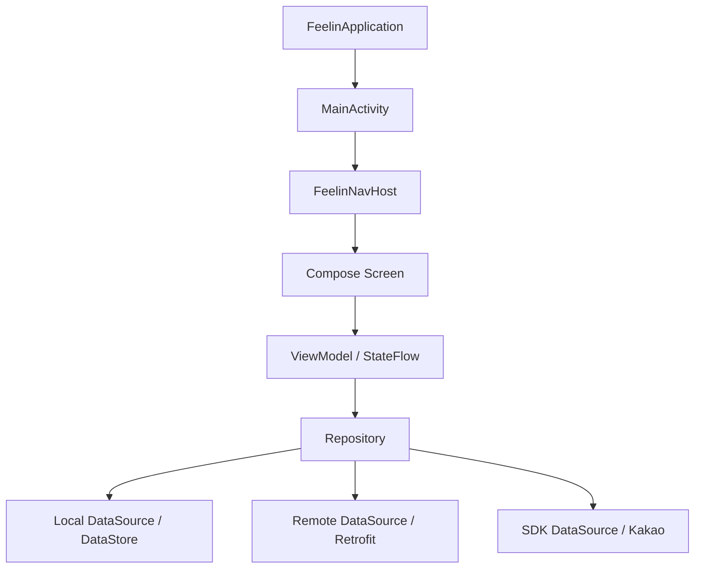

# Feelin Android

> 이 저장소는 2026년 8월 10일부로 개발을 종료했습니다.
>
> Android MVP를 완성하지 못한 상태에서 중단되었으며 추가 개발이나 유지보수 계획은 없습니다. 이 저장소는 Feelin Android가 목표로 했던 기술적 방향, 실제 구현 범위와 한계를 기록하고자 보존합니다.

## 프로젝트 소개

Feelin은 인디 음악을 중심으로, 인상 깊은 가사와 음악에 대한 감상을 기록하고 같은 아티스트를 좋아하는 사용자들과 소통하도록 기획된 음악 커뮤니티입니다.

이 저장소는 기존 Feelin 서비스를 Android로 확장하려고 개발한 클라이언트입니다. 기존 iOS 앱의 기능만 빠르게 재현하는 포트폴리오 프로젝트를 만드는 대신 출시 이후에도 운영할 Android 앱의 구조를 설계하고 관련 개발 경험을 쌓는 것을 초기 목표로 삼았습니다.

그러나 인증과 앱 운영 기반은 코드 연동까지 구현한 반면, 다수의 핵심 사용자 기능은 UI·상태·내비게이션 구현 단계에 머물렀습니다. 최종적으로 인력 이탈, 팀 내부의 추가 동기 부족, Android 앱 개발의 장기적인 정체가 겹치면서 MVP를 완성하지 못한 채 프로젝트를 종료했습니다.

## Android 프로젝트의 기술적 목표

Android 팀은 다음 목표를 중심으로 프로젝트를 설계했습니다.

- Jetpack Compose로 신규 Android UI를 구축하고 라이트·다크 모드를 지원한다.
- 화면, 상태 관리, 데이터 접근 책임을 분리해 기능을 점진적으로 확장하는 구조를 만든다.
- 소셜 로그인부터 서버 인증, 토큰 저장·갱신, 세션 복구까지 하나의 인증 흐름으로 연결한다.
- 브랜드 디자인을 Material 기본 토큰에 종속시키지 않고 Figma에 정의된 디자인 시스템을 그대로 반영하여 관리한다.
- 개발, 검증, 운영 환경을 분리하고 CI를 PR 병합 전 품질 게이트로 사용한다.
- ViewModel의 상태와 주요 Compose UI를 자동화된 테스트로 검증한다.

## 최종 구현 상태

기능의 존재 여부만 나열하면 화면 구현과 실제 기능 연동을 혼동하기 쉬워 종료 시점의 상태를 세 단계로 구분했습니다.

### 코드 연동 구현

Android 코드에는 아래 연동 흐름을 구현했습니다. 각 흐름이 포함된 앱을 빌드할 수 있는 상태까지 확인했습니다. 아카이빙 시점에도 Kakao 로그인과 같은 외부 SDK 기능은 동작할 수 있지만 Feelin 자체 서버와 연결되는 기능은 동작하지 않습니다.

- Kakao SDK 로그인
- Feelin 서버를 통한 로그인·회원가입과 온보딩 흐름
- 인증 정보 정리를 포함한 로그아웃 전체 흐름
- Access Token·Refresh Token 저장과 갱신
- 앱 시작 시 세션 확인과 자동 로그인
- DataStore 기반 인증·사용자 상태 저장
- 약관 및 개인정보처리방침 내부 WebView
- `dev`, `staging`, `prod` 빌드 환경 분리

인증 영역은 `Repository`가 로컬 저장소, 원격 API, 외부 SDK를 조합하도록 구성했습니다. 자체 서버가 운영되던 개발 당시에는 Kakao 로그인부터 서버 인증과 세션 관리로 이어지는 흐름을 구현했습니다.

### UI·상태·내비게이션 구현

다음 영역은 화면과 사용자 흐름, 일부 ViewModel 상태 및 테스트를 구현했지만 관련 서버 기능을 연결하지 못했습니다.

- 홈 피드와 관심 아티스트 탐색
- 아티스트별 커뮤니티
- 곡 검색과 곡별 노트 조회
- 노트 작성·수정·상세 화면과 댓글 UI
- 좋아요·북마크 관련 UI
- 알림 목록과 상태별 UI
- 게시글 신고와 사용자 차단 흐름
- 마이페이지, 설정, 프로필 및 사용자 정보 수정

### 미완료

- 인증 이외 도메인의 대부분 서버 API 연동
- 회원 탈퇴 API·Repository와 화면·상태 간 연결
- Google 소셜 로그인
- 푸시 알림과 알림 항목에 해당하는 콘텐츠 화면으로 이동하는 기능
- 실제 데이터 기반 홈·커뮤니티·알림·신고·차단 기능
- 사용자 정보 조회·수정의 일부 저장 동작
- 최초 관심 아티스트 선택 화면과 상태의 온보딩 경로 연결
- 피드 페이지네이션과 장기 목록 성능 검증
- 일부 네이티브 UI, WebView 및 공통 컴포넌트의 완전한 다크 모드 대응
- 시스템 내비게이션 방식과 IME 조합에 대한 전체 레이아웃 대응

## 기술 스택

| 영역        | 기술                                               |
| ----------- | -------------------------------------------------- |
| 언어        | Kotlin 2.2                                         |
| UI          | Jetpack Compose, Material 3                        |
| 상태 관리   | ViewModel, StateFlow, Coroutines                   |
| 내비게이션  | Navigation Compose 2                               |
| 의존성 주입 | Hilt                                               |
| 네트워크    | Retrofit, OkHttp, Kotlinx Serialization            |
| 로컬 저장소 | Preferences DataStore                              |
| 이미지      | Coil                                               |
| 소셜 로그인 | Kakao SDK                                          |
| 정적 분석   | Detekt, Compose rules                              |
| 테스트      | JUnit 4, Coroutines Test, Compose UI Test          |
| CI          | GitHub Actions                                     |
| 빌드 환경   | Gradle Kotlin DSL, Version Catalog, Product Flavor |

## 아키텍처

프로젝트는 엄격한 Clean Architecture보다 Google 권장 앱 아키텍처를 출발점으로 삼았습니다. 현재 런타임 진입 흐름은 `FeelinApplication`에서 `MainActivity`, `FeelinNavHost`로 이어집니다.



이 흐름은 인증 영역을 기준으로 하며 다른 기능은 대부분 UI와 상태만으로 구성됐습니다.

주요 소스 구조는 다음과 같습니다.

```text
app/src/main/java/com/lyrics/feelin/
├── core/
│   ├── data/                  # datasource, repository, interceptor, DI
│   ├── designsystem/          # 공통 Compose 컴포넌트와 아이콘
│   └── domain/                # 공유 모델과 enum
├── navigation/                # 목적지와 앱 내비게이션 그래프
├── presentation/
│   ├── designsystem/theme/    # 브랜드 색상과 CompositionLocal
│   └── view/                  # 기능별 화면, 상태, ViewModel
├── FeelinApplication.kt
└── MainActivity.kt
```

레이어 구조는 인증 기능에서 가장 구체적으로 구현됐습니다. 홈, 커뮤니티, 알림 등은 같은 방향으로 확장할 화면과 상태 골격은 갖췄지만 종료 시점까지 동일한 수준의 데이터 레이어와 서버 연동을 완성하지 못했습니다.

## 주요 기술 결정과 트레이드오프

### 싱글 모듈로 시작

처음부터 엄격한 멀티 모듈 구조를 적용하는 방안도 검토했지만 팀의 경험과 개발 속도를 고려해 단일 `:app` 모듈로 시작했습니다. 경험이 충분하지 않은 상태에서 모듈의 경계를 먼저 고정하면 기능 구현 속도가 크게 느려질 수 있다고 판단했습니다.

이 선택으로 초기 진입 비용을 낮췄습니다. 그러나 앱의 규모가 커지기 전에 프로젝트가 중단되어 기능과 공통 책임을 모듈 단위로 분리하는 단계에는 도달하지 못했습니다.

### XML 마이그레이션 없이 Compose 채택

기존 XML 앱을 전환하는 프로젝트가 아니라 운영을 목표로 한 신규 앱이었기 때문에, 마이그레이션 경험 자체를 목표로 삼지 않고 처음부터 Compose로 작성했습니다. 이를 바탕으로 공통 컴포넌트, 상태 기반 UI, 라이트·다크 프리뷰와 Compose UI 테스트를 함께 구축했습니다.

### Google 권장 앱 아키텍처와 MVVM

엄격한 Clean Architecture와 MVI도 검토했지만 앱 제작과 운영 일정에 더 현실적인 Google 권장 앱 아키텍처와 MVVM을 선택했습니다. 초기부터 모든 이벤트를 Intent로 모델링하는 비용을 줄이고 ViewModel과 StateFlow를 중심으로 상태를 관리했습니다.

결과적으로 인증 영역처럼 서버와 연동된 기능은 책임이 비교적 명확하게 분리됐지만 일부 전역 UI와 내비게이션에 관한 책임은 한 파일에 집중됐습니다.

### Hilt 선택

Koin과 비교한 뒤 컴파일 타임 검증을 제공하는 Hilt를 선택했습니다. 앱 런타임에 의존성 구성 오류를 발견하는 상황을 줄이고자 했으며 DataStore, Repository, Retrofit과 인증 관련 컴포넌트를 구성할 때 실제로 사용했습니다.

### Retrofit과 OkHttp 선택

Ktor 대신 팀이 익숙하고 참고 자료가 풍부한 Retrofit과 OkHttp를 선택했습니다. 인증 헤더, 기기 식별자, 앱 버전과 토큰 갱신을 네트워크 계층에서 처리했습니다.

다만 인터셉터에서 동기적으로 인증 상태에 접근하는 구현이 남았고 이를 비동기 흐름과 안전하게 결합하는 리팩터링은 완료하지 못했습니다.

### Coil 선택

Glide와 Fresco 대신 Compose 및 Kotlin과의 통합성이 높은 Coil을 사용했습니다. 원격 이미지 로딩에 Coil을 사용했고 일부 알림 썸네일에 placeholder와 error 이미지를 적용했습니다.

### Material과 브랜드 디자인 토큰 분리

Feelin의 디자인 시스템은 Material 색상 체계와 달랐습니다. 초기에는 Material 색상 체계에 자체 토큰을 대응시키는 방안을 고려했으나 이후 `CompositionLocal` 기반의 `LocalFeelinColors`로 브랜드 토큰을 분리했습니다.

이 구조로 Compose 컴포넌트의 라이트·다크 모드를 일관되게 관리했습니다. 다만 `NumberPicker`나 WebView처럼 View 시스템 테마의 영향을 받는 요소에는 별도 대응이 필요했습니다.

### 환경별 Product Flavor

단일 빌드 환경과 하드코딩된 서버 주소·외부 SDK 키를 `dev`, `staging`, `prod` flavor로 분리했습니다. 각 환경은 별도의 Application ID, 앱 이름과 Kakao Native App Key를 사용합니다. 자체 서버 엔드포인트는 `dev`와 `staging`이 개발 서버를 공유하고 `prod`가 운영 서버를 사용합니다.

CI도 브랜치에 따라 개발·검증·운영 variant를 빌드하도록 구성했습니다. 다만 자체 서버는 HTTPS를 지원하지 않아 API 통신이 평문 HTTP에 의존한다는 외부 제약이 남았습니다.

## 개발 전략의 변화

초기에는 디자인 시스템과 변경 가능성이 낮은 화면을 먼저 구현하며 Android 팀의 작업 방식과 속도를 확인했습니다. 이후 로그인, 온보딩, 마이페이지 UI를 구축하고 기능을 연결하는 방향으로 진행했습니다.

하지만 로그인과 회원가입, 마이페이지 작업이 예상보다 오래 지속됐고 서버 상태 및 API 접근 문제도 실제 연동을 지연시켰습니다. Android 팀 내부에서도 로그인 완료를 다른 기능의 선행 조건처럼 다루면서 적절한 하위 작업을 배분하지 못했고 화면이 존재하는 상태와 사용 가능한 기능이 완성된 상태 사이의 차이가 커졌다고 평가했습니다.

진행을 회복하려고 다음 방식들을 검토했습니다.

- 모든 화면과 내비게이션을 만든 뒤 API를 연결하는 방식
- AI 에이전트로 화면 구현 속도를 높인 뒤 API를 연결하는 방식
- 화면별 골격과 전체 흐름을 먼저 연결하고, 각 화면의 API를 순차적으로 완성하는 방식

최종적으로 세 번째 방식을 중심으로 삼았으며 팀원들이 프로젝트에 투입할 수 있는 시간이 줄어들면 AI 에이전트를 활용하는 방향을 택했습니다. 이후 홈, 노트 상세·작성, 알림, 신고, 차단 등의 화면과 테스트를 빠르게 확장했지만 팀원들의 일정 문제와 팀이 프로젝트를 계속 추진할 동기가 부족한 상황과 같은 개발 외적 문제까지 해결하지는 못했습니다.

## 품질 관리

### 정적 분석과 CI

Detekt에 formatting 및 Compose 규칙을 결합하고 `app/detekt.yml`을 저장소의 코드 품질 기준으로 사용했습니다. GitHub Actions에서는 Detekt 정적 분석과 빌드 가능 여부를 차례로 검사했습니다.

```text
detekt
  └── Build Check
        ├── 모든 PR 및 push: assembleDevDebug
        ├── develop push: assembleStagingDebug, assembleStagingRelease
        └── main push: assembleProdDebug, assembleProdRelease
```

### 테스트

종료 시점에는 아래 테스트가 포함되어 있습니다.

- 인증 및 로그인 오류 모델 단위 테스트
- 온보딩 회원가입 직렬화 테스트
- 홈·노트 작성·알림 ViewModel 및 UI 상태 테스트
- 내비게이션 목적지 테스트
- 공통 버튼과 출생연도 피커 Compose UI 테스트
- 알림, 신고, 차단 사용자, 관심 아티스트 화면 UI 테스트

후반부에는 에이전틱 코딩의 구현·검증 과정에 테스트를 포함하면서 화면을 구현할 때 관련 테스트도 함께 추가하는 작업 방식을 정착시켰습니다. 그러나 실제 서버 Repository를 구현하지 못한 영역이 많아서 전체 사용자 흐름을 검증하는 통합 테스트는 부족합니다.

## 알려진 기술 부채

개발 종료 시점에 다음 문제가 남아 있습니다.

- [`FeelinNavHost`의 Scaffold·전역 오버레이 책임 집중](https://github.com/project-lyrics/app-Android/issues/51)
- [OkHttp 인터셉터의 `runBlocking` 제거 필요](https://github.com/project-lyrics/app-Android/issues/39)
- [마지막 로그인 공급자의 메모리·로컬 상태 불일치](https://github.com/project-lyrics/app-Android/issues/48)
- [프로필 화면의 키보드와 시스템 내비게이션 여백 대응](https://github.com/project-lyrics/app-Android/issues/53)
- [홈 필터가 안정적인 식별자를 사용하지 않는 문제](https://github.com/project-lyrics/app-Android/issues/62)
- [WebView 내부 콘텐츠의 다크 모드 대응 미완료](https://github.com/project-lyrics/app-Android/issues/44). `NumberPicker`에서 발생한 문제로 인해 View 시스템의 다크 모드 대응 코드는 추가했지만 실제 약관 콘텐츠가 다크 모드에서 어떻게 렌더링되는지는 검증하지 않았습니다.
- [일부 체크박스의 다크 모드 미지원](https://github.com/project-lyrics/app-Android/issues/66)
- [공통 버튼과 디자인 명세의 정합성](https://github.com/project-lyrics/app-Android/issues/68)
- 운영용 앱의 서명 키와 서명 설정을 구성하지 못했습니다. 앱 기능을 완성한 뒤에 서명 키를 할당하고 관련 설정을 추가할 예정이었습니다.
- 네트워크의 `App-Version` 헤더가 `BuildConfig.VERSION_NAME` 대신 `1.0.3`으로 고정되어 있습니다. 개발 중에는 자체 서버가 이미 지원하던 iOS 앱 버전을 헤더에 사용하도록 우회했습니다.
- Access Token·Refresh Token·OAuth Token을 별도의 암호화 계층 없이 Preferences DataStore에 저장합니다.
- `AuthManager`의 Refresh Token 기반 로그인 상태와 `UserPreferencesDataStore`의 온보딩 완료 상태가 별도로 존재합니다. `UserPreferencesDataStore`는 동작 상태를 확인하기 위한 임시 구현이었으며 장기적으로는 로그인 상태를 `AuthManager` 기반으로 통합할 예정이었습니다.

열린 이슈는 후속 구현 계획이라기보다, 프로젝트가 멈춘 지점과 당시 인식하고 있던 한계를 남기는 기록입니다.

## 개발 중단과 회고

Lyrics 팀 프로젝트가 2026년 8월 10일에 종료되면서 Feelin Android 클라이언트의 개발도 같은 날 종료됐습니다. 종료 시점에도 Android MVP는 완성되지 않았습니다.

개발 중단에는 다음 요인이 함께 작용했습니다.

- 프로젝트 인력 이탈
- 남은 팀원들이 프로젝트를 계속 추진할 만한 추가 동기가 부족했음
- Android 앱 개발이 장기간 정체됐음
- 서버 상태와 다른 파트와의 조율에 의존하는 작업의 지연
- 핵심 사용자 흐름을 수직적으로 완성하는 작업보다 기술 기반과 UI 범위를 확장하는 작업을 먼저 추진한 우선순위 문제

프로젝트는 Compose 디자인 시스템, 인증·세션 흐름, 환경 분리, CI와 테스트 기반을 실제 코드로 남겼습니다. 반면 이 기반을 홈에서 노트 작성과 상호작용까지 이어지는 하나의 완성된 사용자 흐름으로 연결하지 못했습니다. UI 구현률과 실제 기능 완성도를 구분하고 있었지만 그 차이를 진행률과 작업 우선순위에 충분히 반영하지 못한 점도 개발 정체를 키웠습니다.

가장 큰 교훈은 좋은 기술 기반만으로 MVP가 완성되지는 않는다는 점입니다. 이를 보완하려면 아래 실행 원칙이 함께 필요했습니다.

- 기반 작업과 동시에 실제 사용 가능한 수직 기능을 작게 완성할 것
- 외부 파트에 의존하는 작업은 인터페이스 계약과 테스트 더블을 사용하여 독립적으로 검증할 수 있게 분리할 것
- 큰 에픽보다 짧은 피드백 주기로 완료 가능한 작업을 우선할 것
- 팀의 가용 인력과 동기를 기능 범위에 지속적으로 반영할 것

이 저장소는 완성된 앱의 성공 사례는 아닙니다. 대신 운영 가능한 Android 앱을 만들기 위해 실제로 내린 기술적 결정, 그 결정이 코드에 반영된 과정, 그리고 이를 제품 완성으로 연결하지 못한 실행상의 한계를 함께 기록합니다.

## 로컬 실행

### 요구 환경

- Android Studio 및 Android SDK 36
- JDK 17
- Android 9(API 28) 이상의 기기 또는 에뮬레이터
- 환경별 Kakao Native App Key

### 로컬 설정

저장소의 예제 파일을 복사해 `local.properties`를 구성합니다.

```properties
sdk.dir=/path/to/android/sdk
kakao.native.app.key.dev=YOUR_DEV_NATIVE_APP_KEY
kakao.native.app.key.staging=YOUR_STAGING_NATIVE_APP_KEY
kakao.native.app.key.prod=YOUR_PROD_NATIVE_APP_KEY
```

빌드하려는 flavor에 해당하는 Kakao Key가 없으면 빌드가 실패합니다. 실제 키는 저장소에 커밋하지 마세요.

### 빌드

```bash
./gradlew :app:assembleDevDebug
```

다른 환경은 다음 variant를 사용합니다.

```bash
./gradlew :app:assembleStagingDebug
./gradlew :app:assembleProdDebug
```

아카이빙 시점에는 자체 서버 연결이 동작하지 않으며 외부 서비스도 이후 중단될 수 있으므로, 빌드 성공이 로그인이나 API 기능의 실제 동작을 보장하지는 않습니다.

### 검증

```bash
./gradlew detekt
./gradlew :app:testDevDebugUnitTest
```

## Android 저장소의 담당 범위

이 저장소에는 Android 팀이 수행한 다음 작업의 결과물이 남아 있습니다.

- Android 앱 구조 및 Gradle 개발 환경 구성
- Compose 화면과 공통 디자인 시스템 구현
- 인증, 세션 관리 및 로컬 저장소 연동
- 기능별 상태와 내비게이션 구성
- CI, 정적 분석 및 자동화 테스트 도입
- Android 기능 명세와 개발 기록 정리

이 문서는 Android 저장소의 기술적 기록만 다루며 Feelin 전체 팀의 역할이나 다른 클라이언트·서버의 기여를 정리하지 않습니다.

## 참고 기록

- [초기 디자인 시스템 도입 PR #1](https://github.com/project-lyrics/app-Android/pull/1)
- [데이터 레이어와 네이밍 논의 PR #10](https://github.com/project-lyrics/app-Android/pull/10)
- [디자인 토큰 분리 PR #23](https://github.com/project-lyrics/app-Android/pull/23)
- [Kakao 및 서버 로그인 연동 PR #14](https://github.com/project-lyrics/app-Android/pull/14)
- [자동 로그인과 세션 복구 PR #46](https://github.com/project-lyrics/app-Android/pull/46)
- [환경별 Product Flavor PR #58](https://github.com/project-lyrics/app-Android/pull/58)
- [홈 화면 구현 PR #61](https://github.com/project-lyrics/app-Android/pull/61)
- [알림 화면 구현 PR #67](https://github.com/project-lyrics/app-Android/pull/67)
