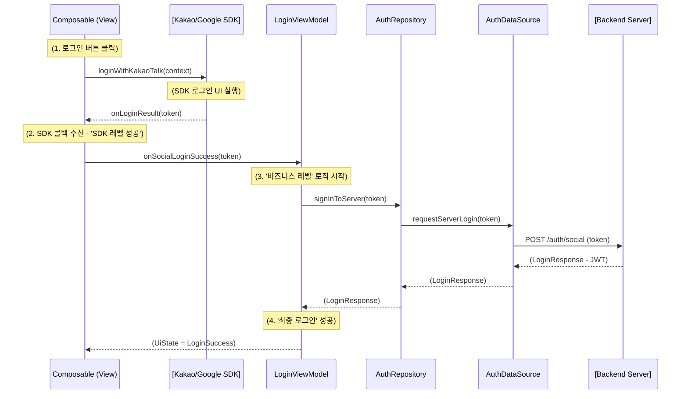

# 소셜 로그인 아키텍처 리팩토링: `Activity` 의존성 분리

> 이 문서는 소셜 로그인(카카오/구글) 기능 구현 시 발생하는 `Activity` 의존성 문제를 해결하고, 앱 아키텍처 및 멀티모듈 환경 대비에 적합하도록 구조를 리팩토링한 내용을 정리합니다.

## 1. 문제 상황

- 카카오, 구글 등 대부분의 소셜 로그인 SDK는 로그인 UI(웹뷰 또는 전용 `Activity`)를 실행하기 위해 `Activity` 또는 `Context`를 파라미터로 요구합니다.
- 클린 아키텍처상 `DataSource`는 `Repository`의 하위 레이어이며, Hilt를 통해 `@Singleton` 스코프로 관리되고 있었습니다.
- `@Singleton` 스코프(Application 생명주기)의 객체가 `Activity` 스코프(Activity 생명주기)의 객체를 참조하면 심각한 **메모리 누수**가 발생하며, Hilt 스코프 규칙에도 위배됩니다.

## 2. 기존 설계의 치명적인 문제점

`DataSource`가 `Activity`에 직접 의존하는 설계는 다음과 같은 심각한 문제를 야기합니다.

### A. 안드로이드 아키텍처 가이드 위반 (안티패턴)

- **관심사 분리(SoC) 위반**: `DataSource`는 데이터 통신에만 관심이 있어야 하나, UI(`Activity`)의 존재를 알게 됩니다.
- **종속성 규칙 위반**: 안드로이드 공식 아키텍처는 **상위 레이어(UI)가 하위 레이어(Data)에 의존**해야 한다고 규정합니다. 하지만 `DataSource`가 `Activity`를 참조하면 **하위 레이어가 상위 레이어에 의존**하는 '역방향 종속성'이 발생합니다.

### B. 추후 멀티모듈 빌드 실패 (순환 종속성)

- 멀티모듈 환경에서 `:data` 모듈은 `:app` 모듈을 알지 못합니다. (의존성: `:app` → `:data`)
- `DataSource`가 `:app` 모듈에 있는 `Activity`를 참조하려면, `:data` 모듈이 `:app` 모듈에 의존해야 합니다. (`:data` → `:app`)
- 이는 `:app` → `:data` → `:app`... 형태의 **순환 종속성(Circular Dependency)**을 만들며, Gradle은 이 구조를 허용하지 않아 **빌드가 실패**합니다.

## 3. 해결 원칙: SDK 책임 분리

이 문제의 근본 원인은 소셜 로그인 SDK가 **두 가지 책임**을 동시에 갖기 때문입니다.

1.  **UI 책임**: 로그인 화면을 띄우고 사용자 입력을 받습니다. (`Activity` 필요)
2.  **데이터 책임**: 인증 성공 시 `AuthCode`나 `AccessToken`을 반환합니다.

이 두 책임을 아키텍처 레이어에 맞게 분리합니다.

- **UI 책임 (View Layer)**: `Activity`에 접근 가능한 Composable(View)에서 SDK의 로그인 UI 실행을 전담합니다.
- **데이터 책임 (Data Layer)**: `DataSource`는 View로부터 전달받은 **결과물(토큰)**만을 사용하여 백엔드 서버와 통신합니다.

## 4. 리팩토링된 아키텍처

### A. Presentation Layer (Composable)

- `Activity`의 `Context`가 필요한 **SDK 로그인 실행**을 담당합니다. (e.g., `UserApiClient.instance.loginWithKakaoTalk(context, ...)` )
- `rememberLauncherForActivityResult` 또는 SDK가 제공하는 콜백을 통해 **SDK의 인증 결과(토큰 또는 오류)**를 수신합니다.
- 수신한 **결과(토큰)만** `ViewModel`에 전달합니다. (e.g., `viewModel.onSocialLoginSuccess(token)`)

### B. ViewModel Layer

- `Activity`에 대해 전혀 알지 못합니다.
- View로부터 `token`을 전달받아 `Repository`를 호출합니다. (e.g., `repository.signInToServer(token)`)
- `Repository`로부터 받은 **'최종 서버 인증 결과'**를 바탕으로 `UiState`를 업데이트합니다.

### C. Data Layer (Repository / DataSource)

- `Activity` 의존성이 **완전히 제거**됩니다.
- `@Singleton` 스코프를 유지하는 데 아무런 문제가 없습니다.
- 메서드 시그니처가 `login(activity)`에서 `signInToServer(token: String)`과 같이 변경됩니다.
- `ViewModel`에서 전달받은 `token`을 사용하여 **'자체체 백엔드 서버'**와 최종 인증 통신을 수행합니다.

## 5. 새로운 상호작용 (Sequence Diagram)

